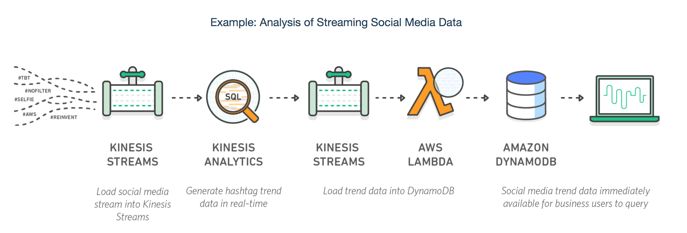
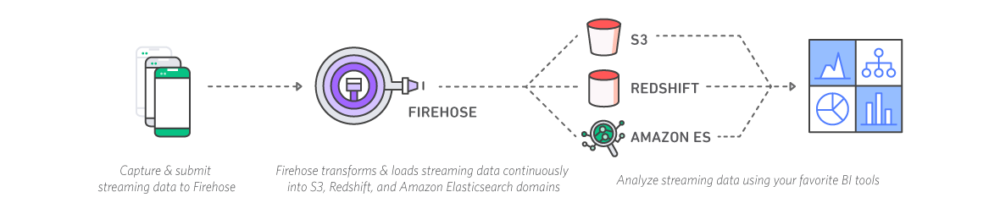
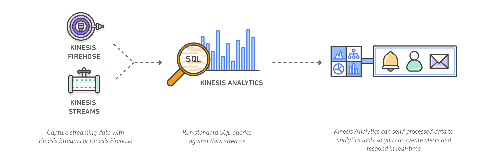
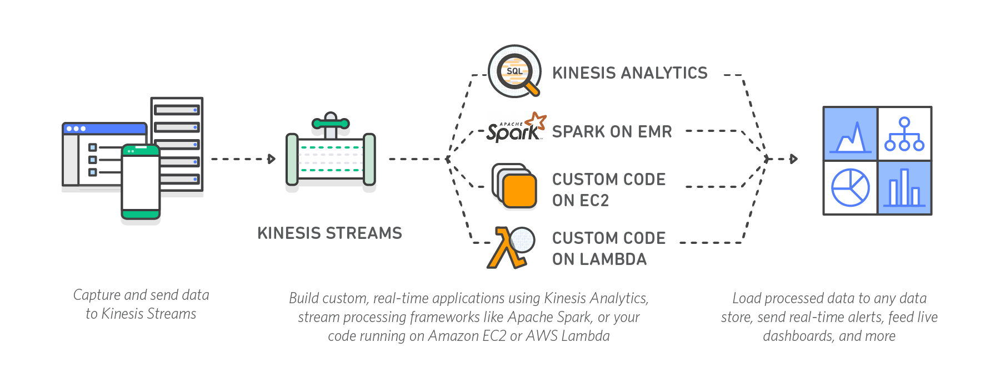

# AWS Summary

- EC2, A3, Kinesis(FIFO : Queue - Stream)
- RDS, DynamoDB, Aurora DB, RedShift
- Cloud-Watch - Lambda(Cron tab > AWS에 Upload)
- KPL, KCL
---

## Server
#### 1. EC2(Elastic Compute Cloud)
- Amazon Elastic Compute Cloud(EC2)는 안전하고 크기 조정이 가능한 컴퓨팅 파워를 클라우드에서 제공하는 웹 서비스입니다. 개발자가 더 쉽게 웹 규모의 클라우드 컴퓨팅 작업을 할 수 있도록 설계되었습니다.

- 장점
1. 탄력적인 웹 규모 컴퓨팅
	- [Auto Scailing](https://aws.amazon.com/ko/autoscaling/?sc_channel=ba&sc_campaign=autoscalingonec2&sc_geo=mult&sc_country=global&sc_outcome=aware)을 통한 자동 확장 및 축소 
2. 완전 제어
	- CLI 제공
	- 다양한 Command(API) 제공
3. 유연한 클라우드 호스팅 서비스
	- 다양한 OS 서버
	- 메모리, CPU, 스토리지, 부팅 파티션 선택
4. 통합
	- Storage, RDS, VCP 등과 통합 가능
5. 안정성
6. 보안
	- VPC와 함께 리소스 보안성 및 강력한 네트워킹 기능 제공

#### - Auto Scailing
- Auto Scaling을 사용하면 애플리케이션 가용성을 유지하는 데 도움이 되며, **사용자가 정의한 조건**에 따라 자동으로 Amazon EC2 용량을 급격하게 확장 또는 축소할 수 있습니다. 또한, **EC2 인스턴스의 동적 조장**을 위해 Auto Scaling을 사용하면 수요가 급증할 때는 Amazon EC2 인스턴스 수를 자동으로 늘려 성능을 유지하고 수요가 잠잠해지면 용량을 줄여 비용을 절감할 수 있습니다.

#### 2. Lambda
- Run code without thinking about servers. Pay for only the compute time you consume.

- Lambda 장점
1. AWS 서비스와의 쉬운 확장가능성 
	- S3, DynamoDB 등
2. Amazon API Gateway를 통한 Custom API 가능 (내외부 둘다 가능)
3. Amazon CloudWatch를 통한 모니터링 및 자체적인 로깅 등 다양한 서비스 제공(관리 포인트 축소)
4. Automatic Scaling
5. 새로운 러닝커브 없이 적용가능(대부분의 언어 지원)
6. 병렬로 실행되며, 각 트리거는 개별적으로 처리되어 높은 정확도 및 속도
7. Lambda Edge를 통한 사용자와 가까운 location의 서버에서 실행

#### 3. VPC(Virtual Private Cloud)
- VPC를 사용하면 고객이 정의하는 가상 네트워크에서 AWS 리소스를 시작할 수 있도록 Amazon Web Services(AWS) 클라우드에 논리적으로 격리된 공간을 프로비저닝할 수 있습니다. IP 주소 범위 선택, 서브넷 생성, 라우팅 테이블 및 네트워크 게이트웨이 구성 등 가상 네트워킹 환경을 완벽하게 제어할 수 있습니다.  VPC에서 IPv4와 IPv6를 모두 사용하여 리소스와 애플리케이션에 안전하고 쉽게 액세스할 수 있습니다.

- VPC의 장점
1. 다중 연결 옵션
	- 공개/비공개 설정 가능
	- VCP들 간의 연결 가능
	- S3 및 다양한 VPC 엔드포인트를 통해 요청 및 사용자 제어 가능
2. 보안
	- In-Bound, Out-Bound 필터링 사용 가능

---
## Storage
#### 1. S3
- S3를 통해 비용 최적화, 액세스 제어 및 규정 준수 데이터를 유연하게 관리할 수 있습니다. S3는 쿼리 지원 기능을 가진 유일한 클라우드 스토리지 솔루션으로, S3에 있는 데이터에 대한 강력한 분석을 바로 실행할 수 있습니다

#### 2. EBS(Elastic Block Store)
- 스토리지 종류
	1. SSD
	데이터베이스 및 부트 볼륨과 같은 트랜잭션 워크로드를 위한 SSD 지원 스토리지(주로 IOPS가 성능을 좌우)
	2. HDD
	MapReduce 및 로그 처리와 같은 처리량 집약적 워크로드를 위한 HDD 지원 스토리지(주로 초당 MB가 성능을 좌우)

- 장점
1. 탄력적 볼륨
	- 운영 중단과 성능에 영향없이 동적으로 변경 및 튜닝가능
	- Amazon CloudWatch를 AWS Lambda와 함께 사용하면 변화하는 애플리케이션의 요구 사항에 맞춰 자동으로 볼륨을 변경가능
2. 스냅샷
	- S3에 전송되지 않아도 연결된 EC2 인스턴스를 통해 즉시 액세스 가능
	- 특정 시점의 데이터를 S3에 저장가능
	- 새로운 저장시 변경된 부분만 저장되어 변경된 부분에 따라 비용부과
	- 스냅샷 공유
	- 리전 전체에 복사
3. AWS Security를 통환 보안

--- 
## DataBase
#### 1. RDS

#### 2. DynamoDB

#### 3. RedShift

#### 4. AuroraDB

---
## Management
#### 1. Cloud Watch

--- 
## Analysis
#### 1. Kinesis
- 실시간 스트리밍 데이터를 손쉽게 수집, 처리 및 분석

- Example Usage Architecture

- Kinesis 장점
	1. 실시간
		- 실시간으로 데이터를 수집, 버퍼링 및 처리하여 짧은 시간안에 결과도출
	2. 완전 관리형
		- 인프라를 따로 관리할 필요 없음.
	3. 확장 가능
		- 모든 규모의 스트리밍 데이터를 유연하게 처리가능

- Kinesis 메인 기능

1. Amazon Kinesis Firehose
- Firehose는 스트리밍 데이터를 AWS로 로드하는 가장 쉬운 방법입니다. 스트리밍 데이터를 캡처하고 변환하여 Amazon Kinesis Analytics, Amazon S3, Amazon Redshift 및 Amazon Elasticsearch Service로 로드하여, 기존 비즈니스 인텔리전스 도구 및 이미 사용하고 있는 대시보드를 통해 거의 실시간으로 분석할 수 있습니다. 

- How to Use

- Firehose 장점
	1. 사용 편의성
		- Management Console(GUI)을 통한 손쉬운 캡처 및 로드 기능
	2. AWS 데이터 스토어와 통합
		- S3, RedShift, ElasticSearch와 통합하여 운용가능
	3. 서버 없는 데이터 변환
		- 데이터 스토어의 로드되기 전에 데이터 스토어에서 요구하는 형식으로 변환 가능.
	4. 거의 실시간
		- 60초 간격으로 데이터 캡처/로드
	5. 지속적인 관리 불필요

2. Amazon Kinesis Analytics
- Amazon Kinesis Analytics는 새로운 프로그래밍 언어 또는 처리 프레임워크를 배울 필요 없이 표준 SQL을 통해 실시간으로 스트리밍 데이터를 처리할 수 있는 가장 쉬운 방법입니다.

- How to Use

- Amazon Kinesis Analytics 장점
	1. 강력한 실시간 처리
		- 1초 미만의 처리 지연시간으로 실시간 분석
	2. 완전 관리형
	3. 자동 탄력성
	4. 사용 편의성
		- 표준 SQL
		- Schema 편집기
		- SQL 편집기
		- SQL 템플릿 제공

3. Amazon Kinesis Streams
- Amazon Kinesis Streams를 사용하면 특수 요구에 맞춰 스트리밍 데이터를 처리 또는 분석하는 사용자 지정 애플리케이션을 구축할 수 있습니다. Kinesis Streams는 웹사이트 클릭스트림, 금융 거래, 소셜 미디어 피드, IT 로그 및 위치 추적 이벤트와 같은 수십만 개의 소스에서 시간당 테라바이트 규모의 데이터를 지속적으로 캡처 및 저장할 수 있습니다.

- How to Use

- Amazon Kinesis Streams 장점
	1. 실시간
	2. 보안
		- 데이터 암호화를 통한 규제 및 규정 준수 요구사항 충족
			- 서버 측 암호화
			- [AWS KMS 마스터 키](https://aws.amazon.com/ko/kinesis/streams/faqs/#kinesis-encryption)
	3. 사용 편의성
		- KPL(Kinesis Producer Library)
			- Get Data Stream From Server(data ingestion)
		- KCL(Kinesis Client Library)
			- Post Data Stream to Client(Java, NodeJS, .NET, Python, Ruby)
	4. 병렬 처리
		- 병렬처리로 진행되어 분석/전송을 나누어 가능
	5. 탄력성
	6. 안전성

