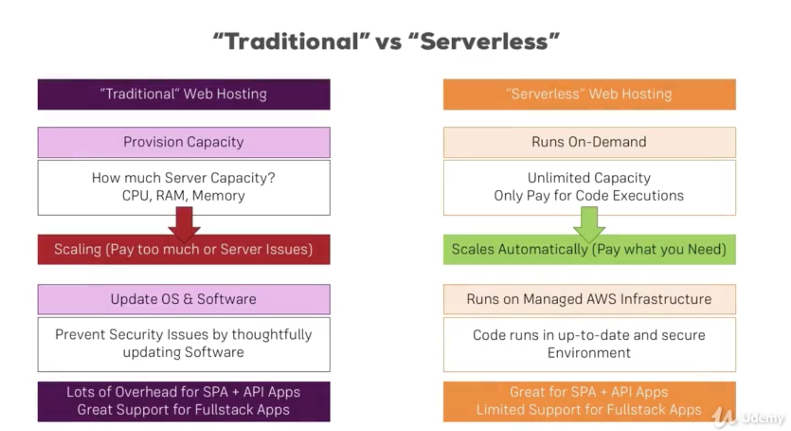
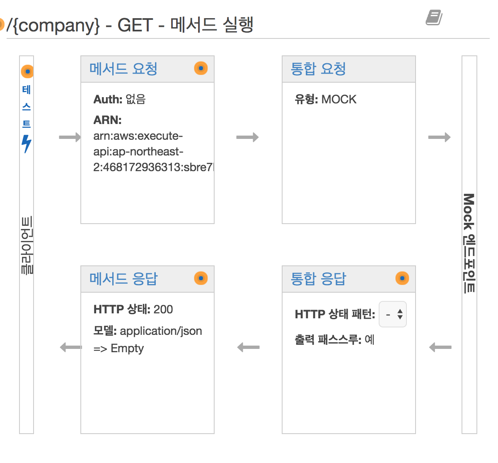

# API-Gate Way
- Author : [HunSeol](https//www.github.com/seolhun)
- 

## [Official Documentation](https://aws.amazon.com/ko/api-gateway/?hp=tile&so-exp=below)
- [API Gateway Mapping Template](https://docs.aws.amazon.com/ko_kr/apigateway/latest/developerguide/api-gateway-mapping-template-reference.html)

## What is API-Gate Way
- To build RESTful Service on the AWS easilly.
- 
	- Resources
		- 
		- 메서드 요청 
			- `URL, Header, model(parameter) 등의 다양한 요청 정보를 설정`할 수 있다.
			- `Request Body`에 대한 유효성 검사 설정을 할 수 있따.
		- 통합 요청(intergration type)
			- Lambda Function : AWS Lambda를 통해 해당 메소드를 실행 할 수 있따.
			- HTTP : HTTP url을 통해 해당 메소드를 실행할 수 있다.
			- Mock
			- AWS service
		- 통합 응답 : `Response`를 regex하여 해당 content에 type에 변화를 줄 수 있다.
		- 메서드 응답
			- `Response state`를 추가/변경 할 수 있다.,
			- `Response Mapping Template`를 변경하여 보낼 수 있다.
	- Stages
		- API-Gateway가 Deploy되는 곳.
	- Authorizers
	- Modles
		- `Template Mapping과 관련된 데이터 형식을 정의`하는 곳
			```json
			{
			  "$schema" : "http://json-schema.org/draft-04/schema#",
			  "title" : "Company",
			  "type" : "object",
			  "properties" : {
			    "index" : { "type" : "integer" },
			    "name" : { "type" : "string" },
			    "url" : { "type" : "string" },
			    "description" : { "type" : "string" }
			  },
			  "required": ["index", "name", "url", "description"]
			}
			```
	- Documentation
	- Binary Support
	- Dashboard

## Reference
- [Udemy - AWS Serverless by `Maximilian Schwarzmüller`](https://www.udemy.com/aws-serverless-a-complete-introduction/learn/v4/content)
